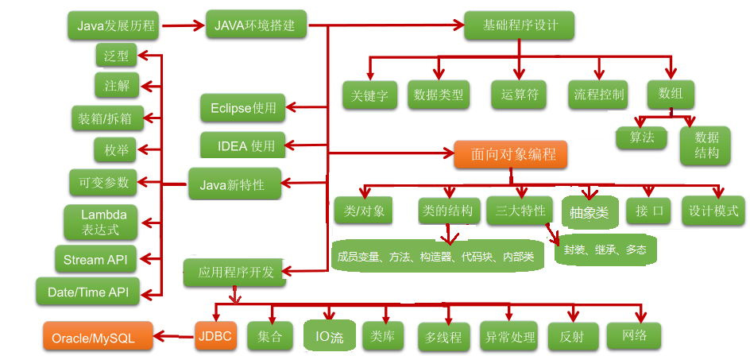

# day01.[环境变量,HelloWorld,常量]

```java
今日重点:
 1.配置java的环境变量
 2.知道jdk和jre以及jvm的关系
 3.常见的dos命令
 4.知道开发三步骤
 5.编写java的入门程序
 6.会使用注释对代码进行解释说明
 7.知道java入门程序中的每一句话代表的啥
 8.知道java入门程序的注意事项
 9.掌握java中的常量
```

# 第一章 Java概述

## 1.1 JavaSE课程体系介绍

JavaSE知识图解



JavaSE知识模块介绍

* **第一部分：计算机编程语言核心结构：**`数据类型`、`运算符`、`流程控制`、`数组`、…  (固定格式,没有为什么,把格式练会)

* **第二部分：Java面向对象核心逻辑：**`类和对象`、`封装`、`继承`、`多态`、`抽象`、`接口`、…

  ​                   为什么要找对象:调用了对象的功能,来替我们完成一些自己不好完成的事儿

* **第三部分：JavaSE核心高级应用：**`集合`、`I/O`、`多线程`、`网络编程`、`反射机制`、…

* **第四部分：Java新特性：**`Lambda表达式`、`函数式编程`、`新Date/Time API`、`接口的默认、静态和私有方法`、…  

* **第五部分：MySQL/JDBC核心技术：**`SQL语句`、`数据库连接池`、`DBUtils`、`事务管理`、`批处理`、…

## 1.2 计算机语言介绍（了解）

### 计算机编程语言是什么

所谓计算机编程语言，就是人们使用编程语言对计算机下达的命令，让计算机完成人们需要的功能。

java C PHP 等 

### 计算机语言发展

* 第一代：机器语言(计算机很庞大,都是0和1组成的指令,而且需要同时按下多个键才能完成一个指令,而且用0和1组成的一个一个指令,所以工程师们就要记住0和1的各种组合以及对应的指令)

* 第二代：汇编语言(面向机器的语言,因为直接面对机器需要记一些 0 和1 的指令,很痛苦,所以就出现了很多助记词,比如:add.汇编语言现在还在使用,接近于机器语言,越接近机器语言,速度越快,而且最终还是转成0和1存储)

* 第三代：高级语言(更接近我们人类语言,常见的有很多,比如C语言,java等)

  ```java
  不管是什么语言,最终都要向机器语言靠拢,因为CPU只认识0和1
  ```

### 计算机语言排行榜


### 计算机语言走势


## 1.3 Java语言概述（了解）

### Java生态圈

**Java是目前应用最为广泛的软件开发平台之一。**随着Java以及Java社区的不断壮大，Java 也早已不再是简简单单的一门计算机语言了，它更是一个平台、一种文化、一个社区。

**作为一个平台，**Java虚拟机扮演着举足轻重的作用。除了 Java语言，任何一种能够被编译成字节码的计算机语言都属于Java这个平台。Groovy、Scala、 JRuby、Kotlin等都是Java平台的一部分，它们依赖于Java虚拟机，同时，Java平台也因为它们变得更加丰富多彩。而且Java还可以跨平台

**作为一种文化，**Java几乎成为了 “开源”的代名词。在Java程序中，有着数不清的开源软件和框架。如Tomcat、Struts, Hibernate, Spring,MyBatis等。就连JDK和JVM自身也有不少开源的实现，如OpenJDK、Apache Harmony。可以说，“共享”的精神在Java世界里体现得淋漓尽致。

**作为一个社区，**Java拥有全世界最多的技术拥护者和开源社区支持，有数不清的论坛和资料。从桌面应用软件、嵌入式开发到企业级应用、后台服务器、中间件，都可以看到Java的身影。其应用形式之复杂、参与人数之众多也令人咋舌。可以说，Java社区已经俨然成为了一个良好而庞大的生态系统。**其实这才是Java最大的优势和财富。**

### Java 是最好的语言吗？

不是，因为在每个领域都有更合适的编程语言。

- C 语言无疑是现代计算机软件编程语言的王者，几乎所有的操作系统都是 C 语言写成的。C里面有一个编译器,会将系统软件变成机器语言,让硬件识别,和硬件做交互.C++ 是面向对象的 C 语言，一直在不断的改进。


- JavaScript 是能运行在浏览器中的语言，丰富的前端界面离不开 Javascript 的功劳。近年来的 Node.js 又在后端占有一席之地。
- Python 用于系统管理，并通过高性能预编译的库，提供 API 来进行科学计算，文本处理等，是 Linux 必选的解释性语言。现在Python也被用于web开发、科学计算和统计、人工智能、网络爬虫等
- Ruby 强于 DSL（领域特定语言），程序员可以定义丰富的语义来充分表达自己的思想。
- Erlang 就是为分布式计算设计的，能保证在大规模并发访问的情况下，保持强壮和稳定性。
- Go 语言内置了并发能力，可以编译成本地代码。当前新的网络相关项目，很大比例是由 Go 语言编写的，如 Docker、Kubernetes 等。
- 编写网页用 PHP，函数式编程有 Lisp，编写 iOS 程序有 Swift/Objective-C。
- R的思想是：它可以提供一些集成的统计工具，但更大量的是它提供各种数学计算、统计计算的[函数](https://baike.baidu.com/item/函数/301912)，从而使使用者能灵活机动的进行数据分析，甚至创造出符合需要的新的统计计算方法 
- SQL 是用于访问和处理数据库的标准的计算机语言， 这类数据库包括：MySQL，Oracle, Sybase, SQL Server, DB2, Access 等等 


一句话概括，**能留在排行榜之上的语言，都是好的语言，在其所在的领域能做到最好。**

### Java语言发展历史

Java诞生于SUN（Stanford University Network），09年SUN被Oracle（甲骨文）收购。

Java之父是詹姆斯.高斯林(James Gosling)。


**詹姆斯·高斯林**等人于1990年代初开发Java语言的雏形，最初被命名为**Oak**，目标设置在**家用电器等小型系统的程序语言**，应用在**电视机、电话、闹钟、烤面包机**等家用电器的**控制和通信**。由于这些智能化家电的市场需求没有预期的高，Sun公司放弃了该项计划。随着1990年代互联网的发展，Sun公司看见Oak在互联网上应用的前景，于是改造了Oak，于1995年5月以Java的名称正式发布。Java伴随着互联网的迅猛发展而发展，逐渐成为重要的网络编程语言。

1996年发布JDK1.0版。

目前最新的版本是Java17。我们学习的Java8。

|   发行版本    |  发行时间  |                             备注                             |
| :-----------: | :--------: | :----------------------------------------------------------: |
|     Java      | 1995.05.23 |     Sun公司在Sun world会议上正式发布Java和HotJava浏览器      |
|   Java 1.0    | 1996.01.23 |             Sun公司发布了Java的第一个开发工具包              |
|   Java 1.1    | 1997.02.19 |                                                              |
|   Java 1.2    | 1998.12.08 |    拆分成：J2SE（标准版）、J2EE（企业版）、J2ME（小型版）    |
|   Java 1.3    | 2000.05.08 |                                                              |
|    Java1.4    | 2004.02.06 |                                                              |
| **Java 5.0**  | 2004.09.30 | ①版本号从1.4直接更新至5.0；②平台更名为JavaSE、JavaEE、JavaME |
|   Java 6.0    | 2006.12.11 |               2009.04.20 Oracle宣布收购SUN公司               |
|   Java 7.0    | 2011.07.02 |                                                              |
| **Java 8.0**  | 2014.03.18 |                                                              |
|   Java 9.0    | 2017.09.22 |    ①每半年更新一次；②Java 9.0开始不再支持windows 32位系统    |
|   Java 10.0   | 2018.03.21 |                                                              |
| **Java 11.0** | 2018.09.25 |           JDK安装包取消独立JRE安装包，长期支持版本           |
|   Java 12.0   | 2019.03.19 |                                                              |
|   Java 13.0   | 2019.9.18  |                                                              |
|   Java 14.0   | 2020.3.17  |                                                              |

```java
Google和Oracle的侵权事件:

Google 和 Oracle 纠缠多年的“Java 侵权案”又有了新的判决结果。Google 在此次对决中败诉，并可能需要支付高达88亿美元的赔偿金。这个案件还引发关于 API（应用程序编程接口）是否应该受版权保护的争议。

其实早在2010年8月，Oracle 就已经向法院起诉 Google 侵权，声称 Google 在开发 Android 平台时未经授权就使用了 Oracle 的 Java 应用编程接口数据包。

另外，虽然 Google 当年为避免版权问题而重写了 Java API，却意外地使用了和 Oracle JDK 相同的一小段代码，这使得 Google 陷入不利的局面。

正是由于 Google 在 Android 平台上使用 Java 时并未和 Sun 公司达成授权协议，造成了巨大的隐患，尤其是在 Oracle 收购 Sun 公司之后。
```


### Java技术体系平台

* JavaSE（Java Platform, Standard Edition标准版）：允许您在桌面和服务器上开发和部署Java应用程序。Java提供了丰富的用户界面、性能、多功能性、可移植性和当今应用程序所需的安全性。
* JavaEE（Java Platform, Enterprise Edition企业版）：是为开发企业环境下的应用程序提供的一套解决方案，主要针对于Web应用程序开发。
* JavaME（Java Platform, Micro Edition 小型版）：为互联网上的嵌入式和移动设备上运行的应用提供了一个健壮、灵活的环境：微控制器、传感器、网关、移动电话、个人数字助理（PDA）、电视机顶盒、打印机等等。JavaME包括灵活的用户界面、健壮的安全性、内置的网络协议，以及支持动态下载的网络和离线应用程序。基于JavaME的应用程序在许多设备上都是可移植的，但是利用了每个设备的本机功能。
  *  Java Embedded(Im'bedId): 用于解锁物联网的智能设备的价值：
     通过远程市场更新和刷新功能延长产品生命周期和价值；
     利用Java的可伸缩性、健壮性、可移植性和全套功能，提高生产效率，降低成本，缩短上市时间；
     在边缘启用快速数据功能；
  *  Java Card：使安全元件（如智能卡和其他防篡改安全芯片）能够承载采用Java技术的应用程序。Java card提供了一个安全的、可互操作的执行平台，它可以在一个资源受限的设备上存储和更新多个应用程序，同时保持最高的认证级别和与标准的兼容性。
  *  Java TV：是一种基于JavaME的技术，它为开发在tv和机顶盒设备上运行的java应用程序提供了一个性能良好、安全且易于实现的解决方案。使用Java TV运行时，开发人员可以轻松创建应用程序，例如电子节目指南（EPG）、视频点播（VOD）客户端、游戏和教育应用程序、用于访问Internet数据的应用程序（例如天气、新闻播报器、社交网络）以及大多数蓝光光盘标题上的用户界面和奖金内容。

# 第二章.Java语言前言

## 1.Java的介绍

```java
1.计算机编程语言:计算机能看懂的语言,我们能使用计算机编程语言对计算进下达指令
2.java之父:詹姆斯高斯林
3.java涉及到的领域:主要用于互联网领域,开发应用程序
  a.各行各业的操作系统,网站
  b.移动端:医疗设备上,超市打印小票机器,鸿蒙,安卓等
  c.电商网站
  d.物流管理
  e.银行使用的操作系统等
  f.桌面应用(idea)
  g.企业级开发(服务器程序)
  h.科学计算:机器人
  i.大数据库开发:hadoop
  j.游戏开发 
4.目前安装的jdk版本:jdk8   
```

## 2.字节

```java
1.计算机中最基本的存储单元,叫做字节,用byte或者B
2.8个二进制位(bit) 等于 一个字节
3.存储单元的计算规则:
  8bit = 1B
  1024B = 1KB
  1024KB = 1MB
  1024MB = 1GB
  1024GB = 1TB    
```


## 3.常用的dos命令

```java
1.打开dos命令窗口
  win+r -> 输入cmd -> 回车
```


| 作用                   | 命令                                                      |
| ---------------------- | --------------------------------------------------------- |
| 切换盘符               | 盘符名: -> 回车 -> 盘符名不区分大小写 ,但是我们得有这个盘 |
| 查看当前目录下得内容   | dir                                                       |
| 进入到指定的目录       | cd 文件夹名                                               |
| 进入到多级目录         | cd 文件夹名\文件夹名                                      |
| 退到上一级目录         | cd.. 或者cd ..                                            |
| 退到磁盘位置           | cd\或者cd \                                               |
| 清屏                   | cls                                                       |
| 关闭dos命令窗口        | exit                                                      |
| 创建文件夹             | mkdir 文件夹名                                            |
| 创建多级文件夹         | mkdir 文件夹名\文件夹名                                   |
| 删除文件夹             | rd 文件夹名(被删除的文件夹必须是空的,而且不走回收站)      |
| 删除文件               | del 文件名.后缀名                                         |
| 批量删除指定类型的文件 | del  *.后缀名                                             |

> dos命令小技巧 
>
> 1.指定文件或者文件夹,可以用tab键自动补全
>
> 2.按上下箭头可以切换之前打过的命令
>
> 3.快速打开到指令目录对应的dos命令窗口
>
>    a.在本地上选中路径,输入cmd

# 第三章.Java所需要的环境

## 1.jvm和跨平台

```java
1.jvm:java虚拟机,是运行所有java程序的假想计算机,是java程序的运行环境之一,也是java最具吸引力的特性之一.我们编写的java代码,都必须运行在jvm之上
    
2.跨平台:一个java代码可以在不同的操作系统上运行
  跨:跨越
  平台:操作系统
      
3.jvm和跨平台的关系:
  一个java程序想要去不同的操作系统上运行实现跨平台,我们需要安装不同版本的jvm
```


## 2.JDK和JRE

```java
1.JRE(Java Runtime Environment):java程序运行时所需要的环境,包含"jvm"和运行时所需要的"核心类库"
2.JDK(Java Development Kit):是java程序开发工具包,包含'JRE'和开发人员使用的工具(javadoc)\
    
3.注意:
  由于jdk包含了jre,jre又包含了jvm
  所以我们只需要安装一个jdk即可
```

> jdk包含jre
>
> jre包含jvm

### 2.1.jdk安装

```java
1.下载:www.oracle.com
```


```java
jdk的安装:
```


> 测试:进入到jdk安装目录的bin路径下
>
> ​         找两个命令: javac.exe   java.exe
>
> ​         然后进入到对应位置的dos命令窗口:输入 javac 和java 命令
>
> javac:编译
>
> java:运行

### 2.2.环境变量的配置

```java
1.配置环境变量的目的:在任意路径下随意使用javac和java命令    
```


```java
配置环境变量的方式:
  1.直接将jdk安装路径的bin路径放到path路径下(不推荐)
  2.JAVA_HOME(最推荐)
```


# 第四章.Java第一个程序的开发

## 1.开发三步骤

```java
1.编写:创建一个xxx.java文件
  a.注意:需要将文件后缀名设置成显示
2.编译:javac -> 生成一个class文件(字节码文件),jvm运行java程序,只认识class文件
  javac java文件名.java
    
  比如: javac Demo01HelloWorld.java  
      
3.运行:java
  java class文件名 -> 不要带后缀,不要带后缀,不要带后缀
    
  java Demo01HelloWorld  
```


## 2.编写HelloWorld

```java
public class Demo01HelloWorld{
	public static void main(String[] args){
		System.out.println("HelloWorld");
	}
}
```


## 3.注释

```java
1.注释:对代码的解释说明,不参与编译和运行
2.分类:
  a.单行注释: //注释内容
  b.多行注释:
    /*
      注释内容
    */
  c.文档注释:
    /**
      注释内容
    */
```

```java
//单行注释  定义一个类,类名叫做Demo01HelloWorld
public class Demo01HelloWorld{
	/*
	  叫做main方法,是程序的入口
	*/
	public static void main(String[] args){
		
		//输出语句
		System.out.println("HelloWorld");
	}
}	
```

```java
文档注释: 可以使用javadoc命令生成此类相关的一个API文档,让别人快速了解此类的作用以及其中的成员
  /**
    注释内容
  */
    
 命令:javadoc -d 要生成的文件夹名字 -author -version 文件名.java   
```

```java
/**
  这是一个Java入门程序
  @author  涛哥
  @version v1.0
*/
public class Demo02HelloWorld{
    /**
	  main方法的作用为程序的入口
	*/
	public static void main(String[] args){
		//输出语句
		System.out.println("HelloWorld");
	}
}	
```


## 4.第一个Java程序中每一句话的解释以及注意事项

```java
/*
  public class Demo03HelloWorld
   public:权限修饰符,代表公共的(面向对象时说)		
   class:代表的是类
   Demo03HelloWorld:类名,要求和java文件名保持一致
   
   
  在定义一个类:类是java程序最基本的组成单元
               所有的代码都要在class类中写
*/
public class Demo03HelloWorld{
  
    /*
	  public static void main(String[] args)
	    public :权限修饰符,代表公共的(面向对象时说)
        static:静态关键字(面向对象时说)	
        void:代表方法无返回值(讲方法的时候说)
        main:方法名
   		(String[] args):main方法的参数,参数类型为String数组,参数名为args(后面说)
		
		main方法是java程序的入口,jvm执行java程序从main方法开始执行  mian
	 
	*/
	public static void main(String[] args){
		//输出语句(打印语句),可以将我们的结果输出到控制台上
		System.out.println("HelloWorld");
	}
}	
```

```java
1.不要将main写成mian,不然jvm找不到程序的入口了
2.代码中的所有标点符号必须是英文状态的
3.写括号要成对的写
4.代码写完之后,用;表示这一句写完了
5.System和String中的首字母s要大写
6.class后面跟的类名要和java文件名保持一致    
```


## 6.关键字

```java
1.概述:java提前定义好的具有特殊含义的小写单词
2.怎么记:
  关键字在高级记事本中颜色特殊,我们学到哪里记到哪里
```


## 7.编写HelloWorld时要注意的问题

### 7.1字符编码问题

```java
1.当cmd命令行窗口的字符编码与.java源文件中的字符编码不一致时,就会在dos命令窗口中出现乱码,原因是啥?
    
  写代码的时候,编码为:UTF-8
  dos命令窗口默认字符集: GBK
      
  a.如果是英文,在这两个编码中(UTF-8和GBK)一个字符就占一个字节
  b.如果是中文,同样的中文内容在这两个编码中所占字节数不一样
    UTF-8:一个中文占3个字节
    GBK:一个中文占2个字节
```


### 7.2源文件名(java文件名)与类名一致问题？

```java
1.源文件名是否必须与类名一致
  a.如果class前面没有public,此时类名可以和java文件名不一致
  b.如果class前面有public,此时类名必须和java文件名保持一致
    
2.一个源文件中是否可以有多个类?
  可以,但是要定义非public的
  
3.main方法必须在public的类在中嘛?
  不是
  但是后面main方法都要写在public的类中
```

> 1.不管class是否为public的,我们的类名都建议和java文件名保持一致
>
> 2.我们尽量在一个java文件中定义一个class类
>
> 3.main方法全部放到public的类中

## 9.println和print区别

```java
相同点:
  两个都是原样输出,可以将结果直接打印到控制台上
不同点:
  println:原样输出,自动换行
  print:原样输出,不会换行
```

> 小技巧:
>
>   1.复制当前行:  ctrl+d
>
>   2.一次写多行:
>
> ​     按住alt不放,鼠标往下拉,让光标变长

# 第五章.常量

```java
1.概述:在代码的运行过程中,值不会发生改变的数据
2.分类:
  整数常量:所有的整数,包括正负 -1 1 
  小数常量:所有带小数点的 2.5  2.0
  字符常量:带单引号的 ''  单引号中必须有,且只能有一个内容
          '1'   对
          '11'  不对
          '1a'  不对
          ' '   对
          '  '  不对
          'tab键' 对
  字符串常量:带双引号 "" 双引号中的内容随意
  布尔常量:true false -> 用于判断条件
  空常量:null -> 代表数据不存在->不能直接使用
```

```java
public class Demo06HelloWorld{
	public static void main(String[] args){
		//整数常量
		System.out.println(1);
		System.out.println(-1);
		
		//小数常量
		System.out.println(2.5);
		System.out.println(2.0);
		
		//字符常量
		System.out.println('1');
		//System.out.println('11');''中必须有且只能有一个内容 11算两个内容
		//System.out.println('');''中必须有且只能有一个内容
		System.out.println(' ');//一个空格算一个内容
		//System.out.println('  ');//一个空格算一个内容,两个空格就是两个内容
		System.out.println('	');//tab键算一个内容
		
		//字符串常量
		System.out.println("张无忌和赵敏以及周芷若还有小昭以及朱九真...没羞没臊的故事");
		System.out.println("");
		//布尔常量
		System.out.println(true);
		System.out.println(false);
		
		//空常量
		//System.out.println(null); null代表数据不存在,不能直接引用
	}
}
```

```java
public class Demo07HelloWorld{
	public static void main(String[] args){
		System.out.println(10+3);//13
		System.out.println(10-3);//7
		System.out.println(10*3);//30
		System.out.println(10/3);//3  如果/前后都是整数,取的整数部分
		System.out.println(10/3.0);// 如果/前后有一个是小数,结果就是带小数点的
	}
}
```


# 第六章.变量

```java
1.概述:在代码的运行过程中,值可以根据不同的情况随时发生改变的数据
       int price = 10;
           price = 8;
2.作用:可以临时存储一个数据
3.java中变量的分类:
  基本数据类型:4类8种
      a.整型:byte short int long
      b.浮点型:float double
      c.字符型:char
      d.布尔型:boolean
          
  引用数据类型:
      类 数组 接口 枚举 注解
          
4.整数默认类型为int
  小数默认类型为double
          
5.按照取值范围从小到大做排序:
  byte short char -> int -> long -> float -> double
      
6.特殊的类型:字符串类型
  用String表示,但是String不属于基本类型,属于一个类,所以属于引用数据类型
  只不过String变量的定义格式和基本类型一样
```

| 数据类型     | 关键字         | 内存占用 | 取值范围                                                |
| :----------- | :------------- | :------- | :------------------------------------------------------ |
| 字节型       | byte           | 1个字节  | -128 至 127  定义byte变量时超出范围,废了                |
| 短整型       | short          | 2个字节  | -32768 至 32767                                         |
| 整型         | int（默认）    | 4个字节  | -2^31^ 至 2^31^-1  正负21个亿<br>-2147483648—2147483647 |
| 长整型       | long           | 8个字节  | -2^63^ 至 2^63^-1   19位数字                            |
| 单精度浮点数 | float          | 4个字节  | 1.4013E-45 至 3.4028E+38                                |
| 双精度浮点数 | double（默认） | 8个字节  | 4.9E-324 至 1.7977E+308                                 |
| 字符型       | char           | 2个字节  | 0 至 2^16^-1                                            |
| 布尔类型     | boolean        | 1个字节  | true，false(可以做判断条件使用)                         |

```java
public class Demo08Var{
	public static void main(String[] args){
		//byte
		byte num1 = 100;
		num1 = 101;
		//num1 = 200;超出了byte的取值范围了
		System.out.println(num1);
		
		//short
		short num2 = 100;
		System.out.println(num2);
		
		//int 整数默认类型
		int num3 = 100000000;
		System.out.println(num3);
		
		/*
		  long 定义long型的变量,习惯上再值得后面加上L或者l
		  建议用L
		*/
		long num4 = 100000000L;
		System.out.println(num4);
		
		/*
		  float 定义float型的变量,请在小数后面加F或者f
		  建议用F
		*/
		float num5 = 2.5F;
		System.out.println(num5);
		
		/*
		  double
		*/
		double num6 = 2.5;
		System.out.println(num6);
		
		/*
		  char 代表字符变量
		*/
		char num7 = '中';
		System.out.println(num7);
		
		/*
		  boolean
		  true false
		*/
		
		boolean num8 = true;
		boolean num9 = false;
		System.out.println(num8);
		System.out.println(num9);
		
		/*
		  num9代表的是false
		  相当于将num9的false赋值给了变量num8,此时num8的true被覆盖了,变成了num9的false了
		*/
	    num8 = num9;
		System.out.println(num8);
		
		/*
		  String 字符串
		*/
		String s = "atguigu";
		s = "taoge";
		System.out.println(s);
	}
}
```

> 注意:
>
>  int i = 10 
>
>  正确的念法:将等号右边的10赋值给等号左边的变量i
>
> ​                     一定是先看等号右边的,如果等号右边是运算的,我们都需要将等号右边的值计算出来,然后再赋值给等号左边的变量