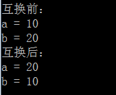

# day01课后练习

# 基础题目:

## 第一题

* 按步骤编写代码，效果如图所示：


* 编写步骤：

1. 定义类 Test1

2. 定义 main方法

3. 控制台输出5行字符串类型常量值

4. 控制台输出5行字符类型常量值

```java
class Test1{
    public static void main(String[] args){
        System.out.println("善学如春起之苗");
        System.out.println("不见其增，日有所长");
        System.out.println("假学如磨刀之石");
        System.out.println("不见其损，年有所亏");
        System.out.println("加油吧！少年");
        
        System.out.println("J");
        System.out.println("A");
        System.out.println("V");
        System.out.println("A");
        System.out.println("!");
    }
}
```


## 第二题

* 按步骤编写代码，效果如图所示：

  


* 编写步骤：

  1. 定义类 Test2
  2. 定义 main方法
  3. 控制台输出5行整数类型常量值
  4. 控制台输出5行小数类型常量值


```java
public class Test2 {

	public static void main(String[] args) {
		System.out.println(-2147483648);
		System.out.println(-100);
		System.out.println(0);
		System.out.println(100);
		System.out.println(2147483647);
		System.out.println(-100.0);
		System.out.println(-10.0);
		System.out.println(0.0);
		System.out.println(10.9);
		System.out.println(100.9);
	}

}
```


## 第三题

- 按步骤编写代码，效果如图所示：

  

- 编写步骤：

  1. 定义类 Test3
  2. 定义 main方法
  3. 控制台输出所有布尔类型常量值

```java
public class Test3 {
	public static void main(String[] args) {
		System.out.println(true);
		System.out.println(false);
	}
}
```


## 第四题

- 按步骤编写代码，效果如图所示：

  

- 编写步骤：

  1. 定义类 Test4
  2. 定义 main方法
  3. 定义2个 byte类型变量,分别赋byte类型范围内最大值和最小值,并输出在控制台.
  4. 定义2个 short类型变量,分别赋short类型范围内的值,并输出在控制台.
  5. 定义2个 int类型变量,分别赋int类型范围内的值,并输出在控制台.
  6. 定义2个 long类型变量,分别赋超过int类型范围的值,并输出在控制台.

```java
public class Test4 {

	public static void main(String[] args) {
		byte minByte = -128;
		byte maxByte = 127;
		System.out.println(minByte);
		System.out.println(maxByte);
		
		short minShort = -32768;
		short maxShort = 32767;
		System.out.println(minShort);
		System.out.println(maxShort);
		
		int minInt = -2147483648;
		int maxInt = 2147483647;
		System.out.println(minInt);
		System.out.println(maxInt);
		
		long minLong = -2147483649L;
		long maxLong = 2147483648L;
		System.out.println(minLong);
		System.out.println(maxLong);
	}

}
```


## 第五题

- 按步骤编写代码，效果如图所示：

  


* 编写步骤：
  1. 定义类 Test5
  2. 定义 main方法
  3. 定义2个 float类型变量,分别赋值,并输出在控制台.
  4. 定义2个 double类型变量,分别赋值,并输出在控制台.

```java
public class Test5 {

	public static void main(String[] args) {
		float f1 = -3.14F;
		float f2 = 3.14F;
		System.out.println(f1);
		System.out.println(f2);
		
		double d1 = -3.4;
		double d2 = 3.4;
		System.out.println(d1);
		System.out.println(d2);
	}

}
```

## 第六题

- 按步骤编写代码，效果如图所示：

  

- 编写步骤：

1. 定义类 Test6
2. 定义 main方法
3. 定义5个 char类型变量,分别赋值,并输出在控制台.
4. 定义2个 boolean类型变量,分别赋值,并输出在控制台.

```java
public class Test6 {
	public static void main(String[] args) {
		char c1 = '9';
		//或 char c1 = 57;
		char c2 = 'J';
		char c3 = 'a';
		char c4 = ' ';
		char c5 = '@';
		System.out.println(c1);
		System.out.println(c2);
		System.out.println(c3);
		System.out.println(c4);
		System.out.println(c5);
		
		boolean yes = true;
		boolean no = false;
		System.out.println(yes);
		System.out.println(no);
	}
}
```


## 第七题

- 按步骤编写代码，效果如图所示：

  

- 步骤图解：

  

- 开发提示：定义变量不赋值的格式

  ```java
  // 	数据类型 变量名 ；
  	int temp；
  ```

- 编写步骤：

  1. 定义类 Test7
  2. 定义 main方法
  3. 定义两个整数变量a，b并赋值
  4. 控制台输出变量a，b互换前的值
  5. 定义一个第三方变量temp，使a，b的值互换
  6. 控制台输出变量a，b互换后的值

```java
public class Test7 {

	public static void main(String[] args) {
		int a = 10;
		int b = 20;
		System.out.println("互换前：");
		System.out.println("a = " + a);
		System.out.println("b = " + b);
		
		int temp = a;
		a = b;
		b = temp;
		System.out.println("互换后：");
		System.out.println("a = " + a);
		System.out.println("b = " + b);
	}

}
```


# 扩展题目:

## 第八题

- 按步骤编写代码，效果如图所示：


* 开发提示：四则运算的符号

  ```java
  加: +
  减: -
  乘: *
  除: /
  ```

* 编写步骤：

  1. 定义类 Test8
  2. 定义 main方法
  3. 定义2个int类型变量x、y，x赋值为100，y赋值为200
  4. 定义新变量add，保存变量x，y的和并打印到控制台
  5. 定义新变量sub，保存变量x，y的差并打印到控制台
  6. 定义新变量mul，保存变量x，y的积并打印到控制台
  7. 定义新变量div，保存变量x，y的商并打印到控制台

```java
public class Test8 {

	public static void main(String[] args) {
		int x = 100;
		int y = 200;
		System.out.println("x,y的和为：" + (x+y));
		System.out.println("x,y的差为：" + (x-y));
		System.out.println("x,y的积为：" + (x*y));
		System.out.println("x,y的商为：" + (x/y));
	}

}
```


## 第九题

- 按步骤编写代码，效果如图所示：

  

- 开发提示：观察小数类型数值运算后的结果.

  ```java
   小数运算经常出现精度丢失的问题,不建议使用基本类型运算.
  ```

- 编写步骤：

  1. 定义类 Test9
  2. 定义 main方法
  3. 定义2个double类型变量x、y，x赋值为100.8，y赋值为20.6
  4. 定义新变量add，保存变量x，y的和并打印到控制台
  5. 定义新变量sub，保存变量x，y的差并打印到控制台
  6. 定义新变量mul，保存变量x，y的积并打印到控制台
  7. 定义新变量div，保存变量x，y的商并打印到控制台

* 提示：
  1. 加法：+
  2. 减法：-
  3. 乘法：*
  4. 除法：/

```java
public class Test9 {

	public static void main(String[] args) {
		double x = 100.8;
		double y = 20.6;
		
		double add = x + y;
		System.out.println("x,y的和为：" + add);
		
		double sub = x - y;
		System.out.println("x,y的差为：" + sub);
		
		double mul = x * y;
		System.out.println("x,y的积为：" + mul);
		
		double div = x / y;
		System.out.println("x,y的商为：" + div);
	}

}
```

# 简答题

1、Java的基本数据类型有哪些？String是基本数据类型吗？

```java
Java的基本数据类型有：byte,short,int,long,float,double,char,boolean
String不是基本数据类型
```

2、float f=3.4;是否正确，表达式15/2*2的值是多少

```java
float f=3.4; //错误，因为3.4默认是double类型
System.out.println(15/2*2); //14，因为15/2结果是7
```

3、char型变量中是否可以存储一个汉字？

```
可以
```

